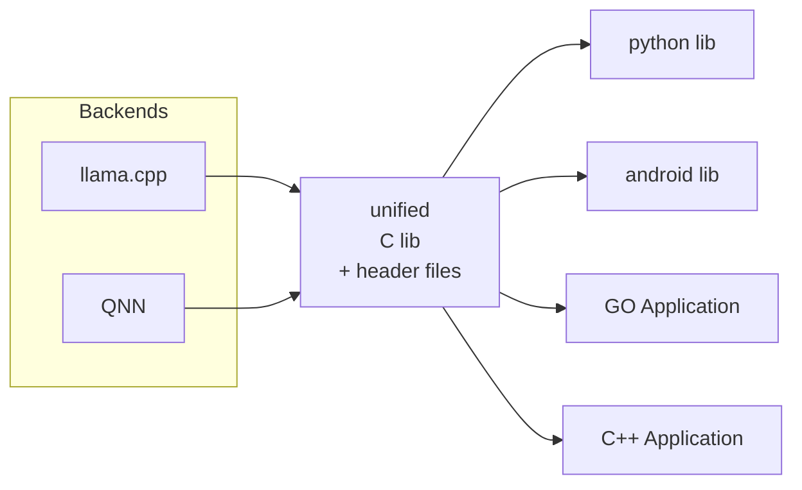

# GenieX-Bridge

## Description

GenieX-Bridge is a unified SDK for Qualcomm-oriented deployments that provides seamless integration for running AI models across multiple backends and platforms. It serves as a bridge layer that abstracts different AI inference engines into a single, consistent C ABI interface through a **dynamic plugin architecture**, enabling developers to deploy models on Python, Android, and C++ without worrying about backend-specific implementations.

## Key Features

- **Multi-Backend Support**: Supports llama.cpp and Qualcomm QNN backends
- **Plugin Architecture**: Dynamic plugin system allows loading only needed backends, reducing binary size
- **Qualcomm Platform Focus**: Works on Windows ARM64, Linux ARM64, and Android
- **Multiple Modalities**: Supports LLM, VLM, ASR, TTS, Image Generation, OCR, Embeddings, Reranking, and Diarization
- **Language Bindings**: Python, Android (Kotlin/Java), and C++ bindings available
- **Lazy Loading**: Plugins are loaded on-demand, reducing startup time
- **Dependency Isolation**: Each plugin manages its own dependencies, avoiding conflicts

This repo consumes the following backend repositories and builds a unified layer to support **any model** on the supported backends:

1. [llama.cpp](https://github.com/ggerganov/llama.cpp) - CPU/GPU inference for LLMs, VLMs, embeddings, and reranking
2. QNN backend through shared c-lib - Qualcomm NPU acceleration (Android/Windows ARM)



## Installation and Usage

Please refer to [INSTALL.md](INSTALL.md) for detailed installation and usage instructions.

## Architecture Design

### Design Documents

- TODO: add the current Qualcomm contact for architecture documents.
- TODO: add the current GenieX-Bridge C native interface document link.
- TODO: add the current GenieX-Bridge architecture design document link.
- TODO: add the current Android SDK design document link.
- TODO: add the current plugin design document link.
- TODO: add the current plugin design considerations document link.

## Plugin Design

Please refer to [plugins/README.md](plugins/README.md).

## Android SDK Design

Please refer to [bindings/android/README.md](bindings/android/README.md).

## Python SDK Design

Please refer to [bindings/python/INSTALL.md](bindings/python/INSTALL.md).

## Development Notice

### Pybind11

For Python bindings, we use pybind11 for C++ extension integration.

If you are going to deal with pybind11, make sure you read the following instructions from [pybind11 documentation](https://pybind11.readthedocs.io/en/stable/advanced/misc.html#common-sources-of-global-interpreter-lock-errors).

**TL;DR**: You should never use a pybind object or a pybind function in a global context, including static functions, constructors/destructors, members of C++ structs, etc. Always use them in a local scope and don't extend them beyond that local scope.

### Python Binding Dynamic Library Conflicts

⚠️ **CRITICAL: Dynamic Library Conflict with llama-cpp-python**

When using the Python binding for this project, be aware of potential dynamic library conflicts if `llama-cpp-python` is also installed in your environment. Both packages may attempt to load their own versions of llama.cpp shared libraries, which can lead to:

- **DLL load failed while importing llm: The specified procedure could not be found.** (Windows)
- Segmentation faults or crashes
- Unexpected behavior or incorrect model outputs
- Symbol resolution conflicts
- Runtime linking errors

**Recommended Solutions:**

1. **Use separate virtual environments** - Install GenieX-Bridge and llama-cpp-python in different Python virtual environments
2. **Uninstall conflicting packages** - Remove llama-cpp-python before installing GenieX-Bridge if both are not strictly necessary
3. **Load order awareness** - If both must coexist, be mindful of import order and consider using `importlib` for controlled loading

**Detection:** If you encounter unexpected crashes or behavior when using the Python binding, check for llama-cpp-python installation:

```bash
pip list | grep llama-cpp-python
```

This conflict arises because both packages embed llama.cpp functionality but may use different versions or compilation flags, leading to ABI incompatibilities at runtime.

<div align="center">
  <p>By Qualcomm</p>
</div>
